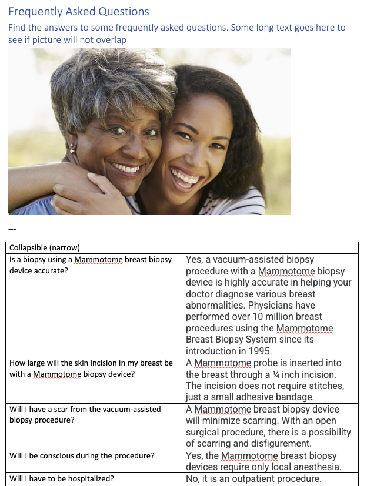

## Collapsible

The Collapsible block is used to hide content until the user clicks on the title. It is usually used for FAQ pages.

### Content Structure

| collapsible         |                       |
|---------------------|-----------------------|
| [Collapsible title] | [Collapsible Content] |

### Example

### Variations

Collapsible block occupies the whole width of the screen unless `narrow` block style is being used.

