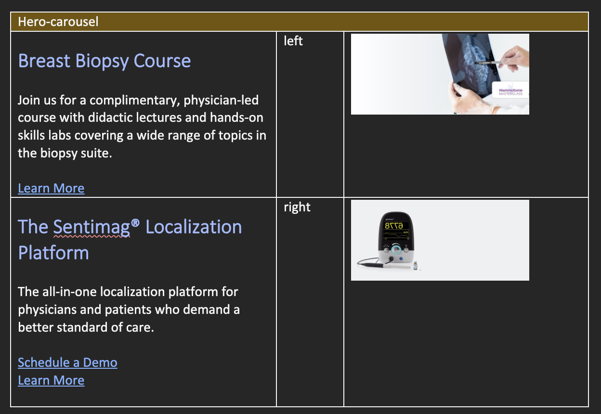

## Hero-Carousel

The Hero-Carousel block creates a carousel with a hero image and text incl. buttons

### Variations

The Table requires 3 columns and at least one row. 
The first column contains the header, text and links (shown as buttons).
The second column contains the the alignment of the text and buttons. Options are: left, center, right. Where left is the default.
the third column contains the image.

### Content Structure

| Carousel                           |                         |         |
|------------------------------------|-------------------------|---------|
| [Header (h1)] [text] [links] | [**left**],[center],[right] | [image] |

### Examples

#### left align

#### right align

