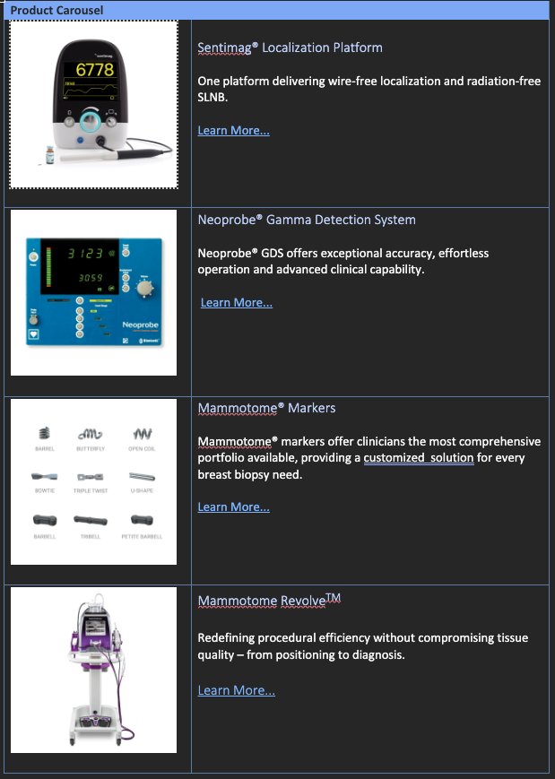

## Product-Carousel

The Product-Carousel Block creates a carousel with a product image and text incl. previous and next navigation.

The navigation moves the slide series to the left or right.

### Variations

The table in word file requires 2 columns and at least three rows. The first column contains the image. The second column contains the  header(h3) with text and a link.

### Content Structure

| Product-Carousel |                                    |
|------------------|------------------------------------|
| [image]          | [Header (h3)] [text] [links] |

### Examples

