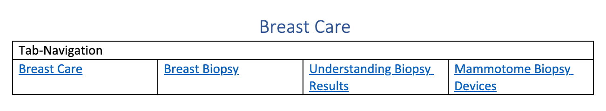
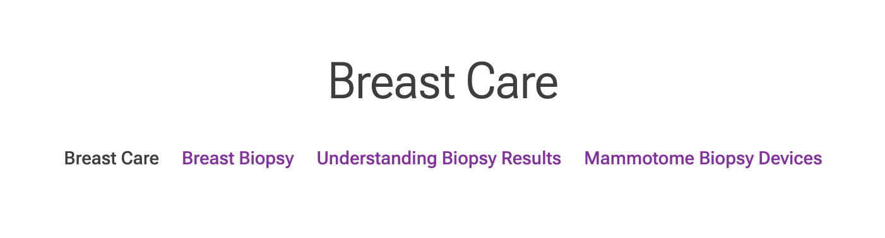

## Tab Navigation

The Tab Navigation block is used to navigate between pages and usually placed on the top of a page.

### Content Structure

| Tab-Navigation |             |             |             |
|----------------|-------------|-------------|-------------|
| [text/link]    | [text/link] | [text/link] | [text/link] |

### Example

