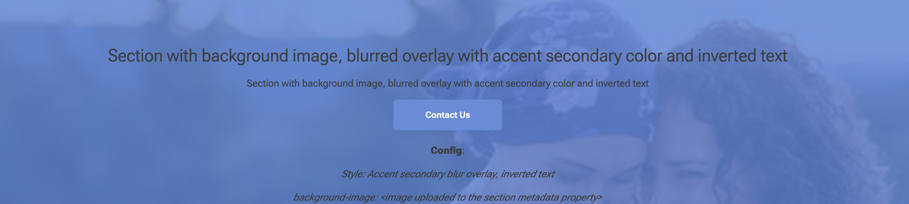
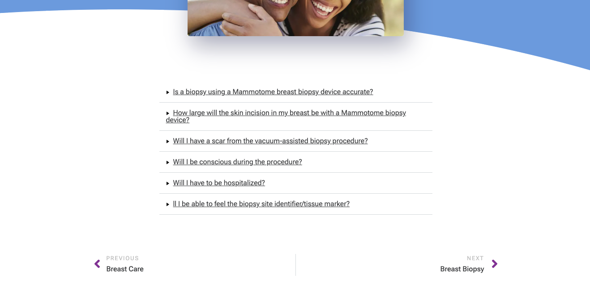
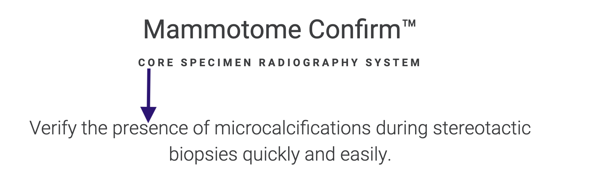

# Section Metadata

Sections are a way to group default content and blocks by the author. Most of the time section breaks are introduced
based on visual differences between sections such as a different background color for a part of a page.

<!-- TOC -->
* [Section Metadata](#section-metadata)
* [Usage](#usage)
  * [Style](#style)
    * [Header](#header)
    * [Text](#text)
    * [Background styles](#background-styles)
      * [Logo Primary background](#logo-primary-background)
      * [Logo secondary background](#logo-secondary-background)
      * [Accent Primary solid background](#accent-primary-solid-background)
      * [Accent quinary solid background](#accent-quinary-solid-background-)
      * [Background Image](#background-image)
      * [Base primary blur overlay](#base-primary-blur-overlay)
      * [Base secondary blur overlay](#base-secondary-blur-overlay)
      * [Accent secondary blur overlay](#accent-secondary-blur-overlay)
      * [Gradient primary blur overlay](#gradient-primary-blur-overlay)
      * [Gradient secondary blur overlay](#gradient-secondary-blur-overlay)
      * [Arc top](#arc-top)
      * [Arc bottom](#arc-bottom)
  * [Callout](#callout)
  * [Narrow](#narrow)
  * [Divider](#divider)
  * [Button-Width](#button-width)
  * [Spacer](#spacer)
    * [After Section](#after-section)
    * [Before Section](#before-section)
    * [After AND before Section](#after-and-before-section)
    * [Section without Spacer](#section-without-spacer-)
    * [Section with additional spacer attribute. Spacer is set to 0:](#section-with-additional-spacer-attribute-spacer-is-set-to-0)
<!-- TOC -->

# Usage

A Section is represented by a leading `---` and a trailing `---`. The Section Metadata Table is being added at the end of the section.
Section Metadata allows the author to add two parameters to a section table with the following attributes (1st column)

`---`

| Section Metadata |                             |
|------------------| --------------------------- |
| Style            | [see style options below]   |
| Divider          | [see divider options below] |
| Spacer           | [see divider options below] |
| background-image | [image]                     |

`---`

## Style

### Nav

Transforms links in the nav bar to buttons.

**_Example:_**

| Section Metadata |            |
|------------------|------------|
| Style            | nav-button |

### Header

| Attribute                       | Feature        | Default                                               | Style                       |
| ------------------------------- | -------------- | ----------------------------------------------------- | --------------------------- |
| _as formatted in word document_ | H1             | font-size: 40px; font-weight: 400; line-height: 1.2   | bold: font-weight: 900      |
| _as formatted in word document_ | H2             | font-size: 28.8px; font-weight: 400; line-height: 1.2 | bold: font-weight: 900      |
| _as formatted in word document_ | H3             | font-size: 20.8px; font-weight: 400; line-height: 1.2 | bold: font-weight: 900      |
| _as formatted in word document_ | H4             | font-size: 16px; font-weight: 400; line-height: 1.2   | bold: font-weight: 900      |
| **align-left**                  | alignment      | center                                                | left aligns  headline       |
| **header-colored**              | color          | black                                                 | color: magenta              |
| **header-uppercase**            | uppercase      | _as formatted in word document_                       | enforces uppercase          |
| **header-wide**                 | letter-spacing | 0                                                     | 4px spacing between letters |

### Text

| Attribute          | Feature                  | Default                                             | Style                                                  |
|--------------------|--------------------------|-----------------------------------------------------|--------------------------------------------------------|
| **text-small**     | text                     | font-size: 16px;font-weight: 400;line-height:1.5rem | font-size: 12px, font-weight: 400, line-height: 24px   |
| **text-medium**    | text                     | -                                                   | font-size: 20.8px;font-weight: 300;line-height:1.95rem |
| **text-large**     | text                     | -                                                   | font-size: 28.8px;font-weight: 300;line-height:2.7rem  |
| **align-left**     | alignment                | center                                              |                                                        |
| **text-wide**      | letter spacing           | 0                                                   | 4px spacing between letters                            |
| **text-uppercase** | uppercase                | _as formatted in word document_                     | enforces uppercase                                     |
| **attached**       | spacing between sections | 5%                                                  | attach text to the previous section                    |

### Background styles

#### Logo Primary background

Adds a magenta background to the section with small Mammotome logos. 

**Note:** the arc at the top will be generated with `arc top` style. see below... 

**_Example:_**

| Section Metadata |                         |
|------------------|-------------------------|
| Style            | logo primary background |

#### Logo secondary background

Adds a light background to the section with small Mammotome logos.

**_Example:_**

| Section Metadata |                           |
|------------------|---------------------------|
| Style            | logo secondary background |

#### Accent Primary solid background

Adds a solid background to the section. The background color is the primary color.

**_Example:_**

| Section Metadata |                                 |
|------------------|---------------------------------|
| Style            | Accent primary solid background |

#### Accent quinary solid background 

[TBD]

#### Background Image

Adds an image to the section. The image is being scaled to fit the section. The background image will ususllay be used with text and/or blurry filters. 

**_Example:_**

| Section Metadata |               |
| ---------------- | ------------- |
| Style            | inverted text |
| background-image | [image]       |

#### Base primary blur overlay

Adds a blur overlay over a section.

**_Example:_**

| Section Metadata |                                                      |
|------------------|------------------------------------------------------|
| Style            | base primary blur overlay, inverted text             |
| Background-Image |  |

#### Base secondary blur overlay

[TBD]

#### Accent secondary blur overlay

Adds an accent overlay over the section. 

**_Example:_**

| Section Metadata |                                                      |
|------------------|------------------------------------------------------|
| Style            | accent secondary blur overlay, inverted text         |
| Background-Image |  |

#### Gradient primary blur overlay

Adds a gradient overlay over the section. 

**_Example:_**

| Section Metadata |                                                      |
|------------------|------------------------------------------------------|
| Style            | gradient primary blur overlay, inverted text         |
| Background-Image |  |

#### Gradient secondary blur overlay

Adds a gradient overlay over the section.

**_Example:_**

| Section Metadata |                                                      |
|------------------|------------------------------------------------------|
| Style            | gradient secondary blur overlay                      |
| Background-Image |  |

#### Arc top

Adds an arc at the top of the section. The arc top is being used in combindation with a background style. See above

**_Example:_**

| Section Metadata |         |
|------------------|---------|
| Style            | arc top |

#### Arc bottom

Adds an arc at the bottom of the section. The arc bottom is being used in combindation with a background style.

**_Example:_**

| Section Metadata |            |
|------------------|------------|
| Style            | arc bottom |

## Callout

Puts the content of the section in the center and sets the the fonts size for h1, h2 and h3 to the same value. Can be used in combination with `arc top`.

**_Example:_**

| Section Metadata |         |
|------------------|---------|
| Style            | Logo primary background, arc top, callout  |

## Narrow

Some Paragraphs are fixed at a certain width to make them easier to read. The **narrow** style is used for this purpose.

Narrow style puts the content in a section that is fixed to **610px**.

## Divider

Adds a divider before or after the section.

| Divider |                                |
| ------- | ------------------------------ |
| before  | add divider before the section |
| after   | add divider after the section  |

**_Example_**

| Section Metadata |       |
| ---------------- | ----- |
| divider          | after |

## Button-Width

Sets the width of the button in a section to a fixed value for all buttons in the section.

| Button-Width |                                              |
|--------------|----------------------------------------------|
| [width]      | button width is set to [width]. Default 100% |

**_Example_**

| Section Metadata |     |
| ---------------- |-----|
| divider          | 305 |

## Spacer

Adds a custom height-spacer in pixels at the beginning and/or end of a section or standalone.

**Pro-Tip:** The Spacer can be used to overwrite the default spacing between sections.

### After Section

| Section Metadata |                               |
|------------------|-------------------------------|
| spacer           | 100                           |

or

| Section Metadata |           |
|------------------|-----------|
| spacer           | 100,after |

### Before Section

| Section Metadata |            |
|------------------|------------|
| spacer           | 100,before |

### After AND before Section

| Section Metadata |                  |
|------------------|------------------|
| spacer           | 100,after,before |

### Section without Spacer 

### Section with additional spacer attribute. Spacer is set to 0:

